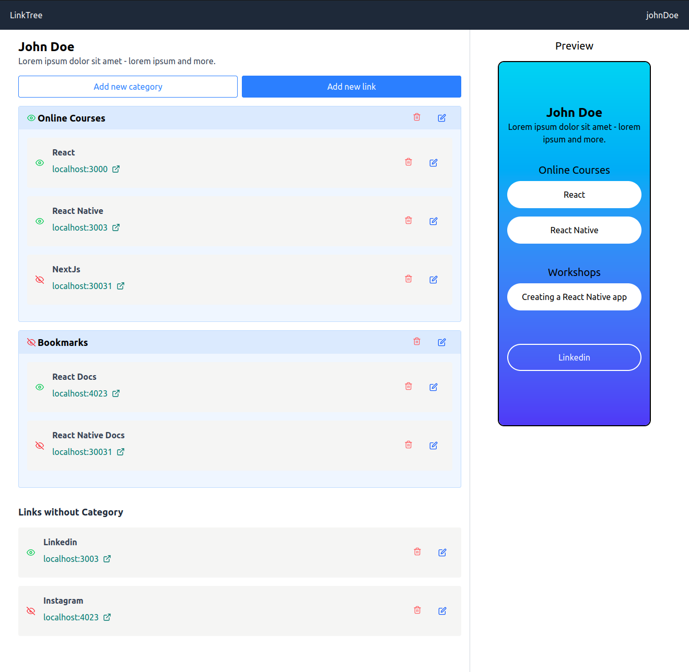
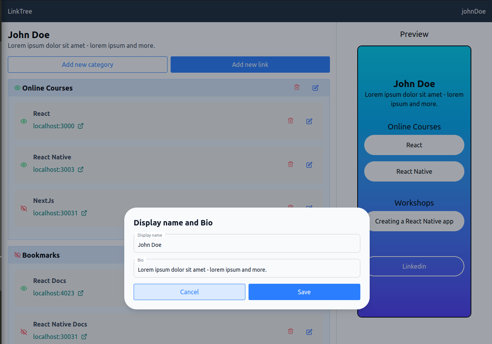
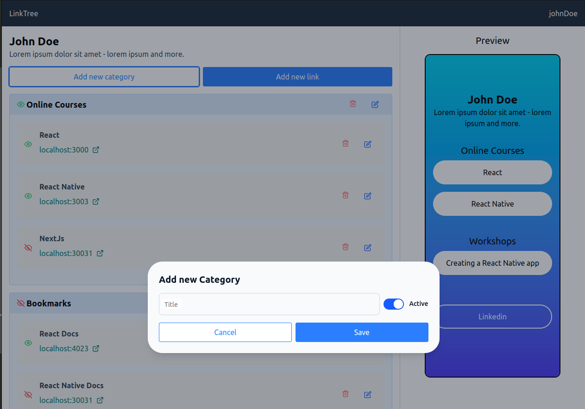
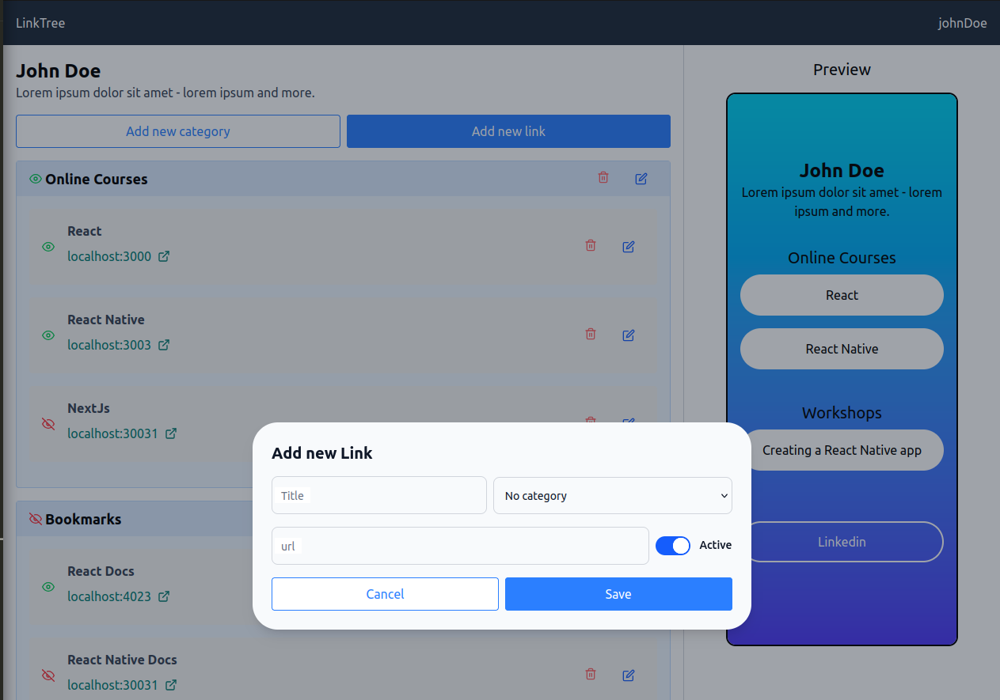
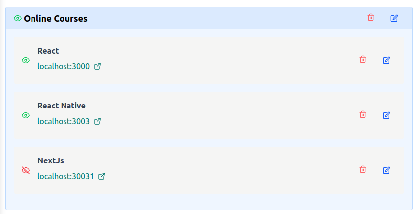
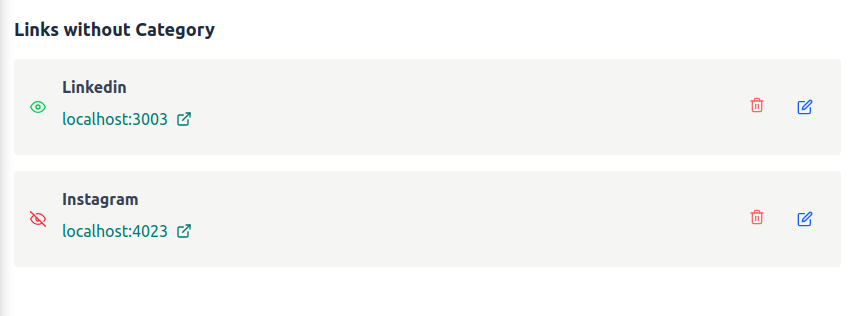
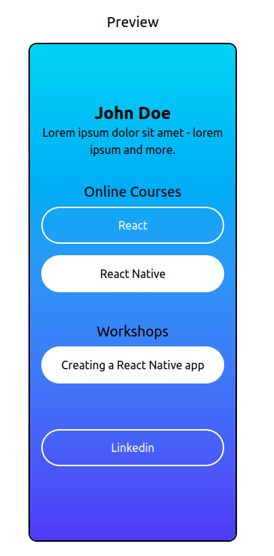
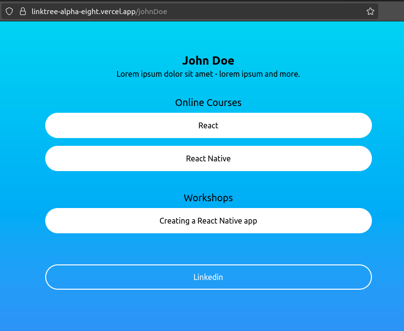
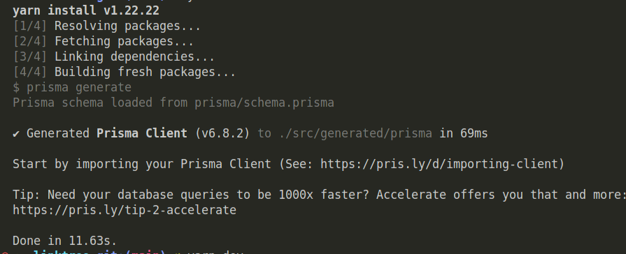
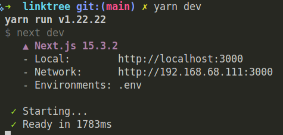

# Summary of implemented feature

## Libraries and tools

For this application, the following tools are used:

- [Next.js](nextjs.org): a React framework used as the foundation of the application.
- [Auth.js](https://authjs.dev/): a library used to implement the authentication flow.
- [Prisma](https://www.prisma.io/orm): an ORM that facilitates communication with the database.
- [bcrypt-ts](https://github.com/Mister-Hope/bcrypt-ts#readme): a library used to hash passwords before storing them.
- [Frame Motion](https://github.com/motiondivision/motion/tree/main/packages/framer-motion): a library used to add animations to UI elements.
- [React Icons](https://react-icons.github.io/react-icons/): a library that simplifies rendering of icons.
- [Supabase](https://supabase.com/): a platform offering a hosted Postgres database services.
- [Vercel](https://vercel.com/): hosting service for Next.js applications.

## Implemented features

1. **Authentication flow**: includes two routes:

- `/register`: allows users to create a new account.
- `/login`: allows users to sign in to the application.

2. **Admin page**:
   
   This is the main route of the application. It includes the following features:

- Edit Profile Form: enables users to update their display name and bio.
  

- Add New Category Form: allows users to create new categories.
  

- Add New Link Form: allows users to create new links.
  

- Categories List: displays a list of categories and their associated links, with options to edit or delete both categories and links.
  

- Uncategorized Links List: displays all links that are not associated with any category.
  

- Preview Section: shows a preview of how the user's landing page will appear on a smartphone.
  

3. **Landing Page**: the public-facing page that displays a user's links.
   

# Scope decisions and key trade-offs

## Decisions Made About Major Libraries and Tools

- **Next.js**: chosen for its efficiency in application development, as well as its high performance.
- **Auth.js**: simple to implement yet robust enough to handle the authentication flow. It's important to note that version 5 is still in beta.
- **Prisma**: chosen for its abstraction that simplifies communication with the database. Prisma offers a hosting service, but it was not used in this project.
- **Supabase**: used as the Postgres database hosting service. Selected for its ease of integration. The project uses the free tier, which is sufficient, though paid plans apply beyond the usage limits.

## Scope decisions

1. Authentication Flow: I implemented the basic flow (registration and login). However, due to the deadline, I chose not to include more advanced features, such as password recovery.

2. UI Smoothness: the interface is functional and responsive, but it could be more interactive. Additionally, it would benefit from design improvements, ideally with the support of a designer.

3. Customization: I implemented the core features (adding links, organizing them into categories, and a landing page). However, given the time constraints, I was unable to include additional customization options, such as choosing background colors or adding images.

4. Error Boundaries: the application works well in the “happy path,” but some edge cases and errors are not handled, which reduces its overall resilience.

5. Tests: Although testing is crucial for maintaining code quality, I prioritized feature development over writing tests. Most of the code consists of visual components, which are better suited for end-to-end testing. That said, there are a few functions that could still benefit from unit tests.

## Setup and run instructions

### Hosted app

| URL to Hosted App                                                                | Link to Repository                                                                                         |
| -------------------------------------------------------------------------------- | ---------------------------------------------------------------------------------------------------------- |
| [linktree-alpha-eight.vercel.app](https://linktree-alpha-eight.vercel.app/login) | [GitHub Repo](https://github.com/renatofreire/linktree) _\*this repo is public. I can change it if needed_ |

Existent users:
| User | Password |
|----------------------|-----------------------|
| johndoe@test.com | _pass_ |
| janedoe@test.com | _pass_ |

### Running locally:

1. Clone the [repository](https://github.com/renatofreire/linktree)

2. Install the dependencies:

```bash
yarn install
```



3. If Prisma files are not generated automatically after installation, run the following command manually:

```bash
npx prisma generate
```

4. Set the environment variables:
   For security reasons, the .env file will be sent via email.

5. Start the local development server:

```bash
yarn dev
```

6. Open the application in your browser. The URL will be displayed in the terminal. It is usually [localhost:3000](localhost:3000).
   
